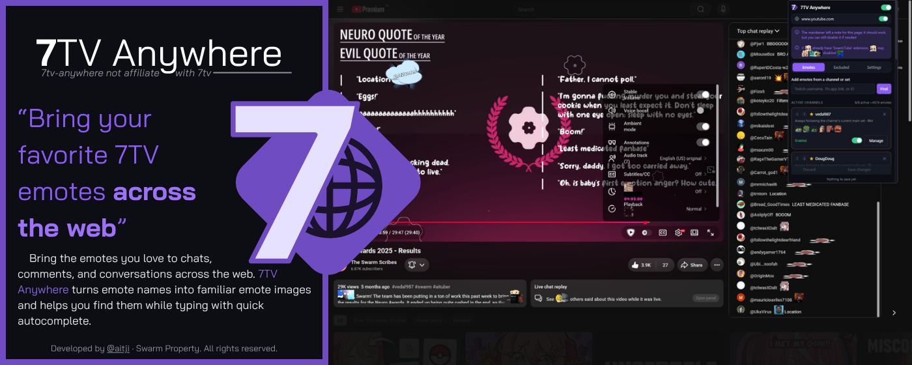
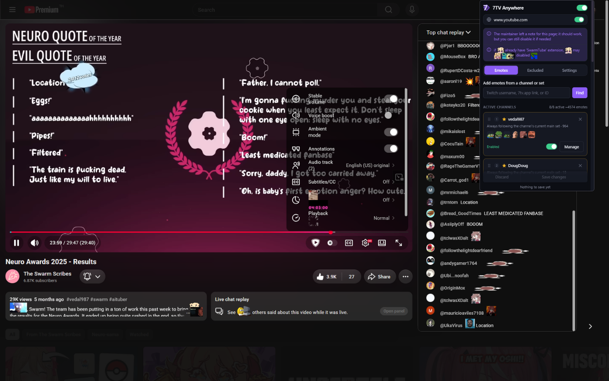
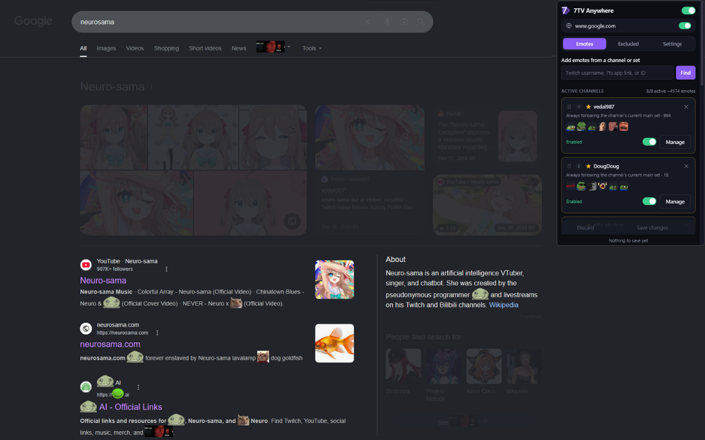

## **7**TV Anywhere

**Take your favorite [7TV](https://7tv.app) emotes beyond Twitch!**

Bring the emotes you love to chats, comments, and conversations across the web. 7TV Anywhere recognizes emote names in supported webpages, displays their familiar images alongside the text, and helps you find emotes while typing with quick autocomplete.

> 7TV Anywhere is an independent, unofficial extension and **is not** affiliated with or endorsed by 7TV.

# 7TV Anywhere
- [7TV Anywhere](#7tv-anywhere-1)
  - [What you can do](#what-you-can-do)
  - [Website compatibility](#website-compatibility)
  - [Installation](#installation)
    - [Packaged build](#packaged-build)
    - [Build from source](#build-from-source)
  - [Privacy](#privacy)
  - [Inspiration](#inspiration)

## What you can do

- [x] Render 7TV emotes in supported webpage text
- [x] Type `:emote` to search in compatible chats, comments, and text fields
- [x] Add emotes from *Twitch channels* or *7TV emote sets*
- [x] Follow a channel's *current main emote set* automatically
- [x] Choose which channels and individual emotes are enabled
- [x] Match emote names with or without case sensitivity
- [x] Enable or disable the extension for individual websites
- [x] Adjust emote size and channel priority
- [x] Import and export your settings
- [x] See loading, saving, and update activity through the popup and extension badge

The popup is designed for both desktop browsers and Firefox for Android. Hidden tabs pause emote processing and release their lookup data until they become visible again, reducing background resource use.



> **alt-message:** 7tv-anywhere's extension showcase on youtube live chat

## Website compatibility

Websites build their text and editors in many different ways. Most ordinary webpage text works naturally, while some *rich-text editors* and *highly interactive pages* need special handling.

**7**TV Anywhere uses the maintainer-authored [`sites.jsonc`](./sites.jsonc) rules to avoid known conflicts and provide site-specific notes. Unsupported websites can still be enabled manually when you want to try them.

Compatibility can *vary* as websites update their layouts. If something breaks, please [open an issue](../../issues) and include the website, the affected page or editor, and what you expected to happen.



> **alt-message:** 7tv-anywhere's extension showcase on google search 'neurosama'

## Installation

Chrome and Firefox store listings are being prepared. Until they are available, you can install a packaged build from [GitHub Releases](../../releases).

### Packaged build

1. Download the zip for your browser from the latest release:
   - `7tv-anywhere-<version>-chrome.zip`
   - `7tv-anywhere-<version>-firefox.zip`
2. Extract the zip.
3. For Chrome, open `chrome://extensions`, enable **Developer mode**, choose **Load unpacked**, and select the extracted folder.
4. For Firefox, open `about:debugging#/runtime/this-firefox`, choose **Load Temporary Add-on**, and select `manifest.json` from the extracted folder.

Firefox temporary add-ons are removed when Firefox closes. A signed store version will install normally once the listing is public.

### Build from source

Requires [Node.js](https://nodejs.org/) 20 or newer.

```sh
npm ci
npm run check
```

The build creates:

- unpacked Chrome and Firefox extensions in `build/`
- ready-to-upload browser packages in `dist/`

Run `npm run build` when you only need to rebuild the packages.


> **alt-message:** 7tv-anywhere's extension showcase on aitji's github

## Privacy

Webpage and text-field content is processed locally. **7**TV Anywhere **does not** contain analytics or advertising and **does not** upload raw webpage text or messages.

See the full **[Privacy Policy](./PRIVACY.md)** for local storage, external service, and data-handling details.

## Inspiration

7TV Anywhere was heavily inspired by [SwarmTube](https://github.com/Igrolodz/7tv-SwarmTube), which brought a similar idea to YouTube comments. This project expands the experience to supported sites across the web.

> The default `vedal987` channel is a little nod to where the idea started.

<hr>

Developed by [@aitji](https://aitji.xyz) · Swarm Property · All rights reserved.